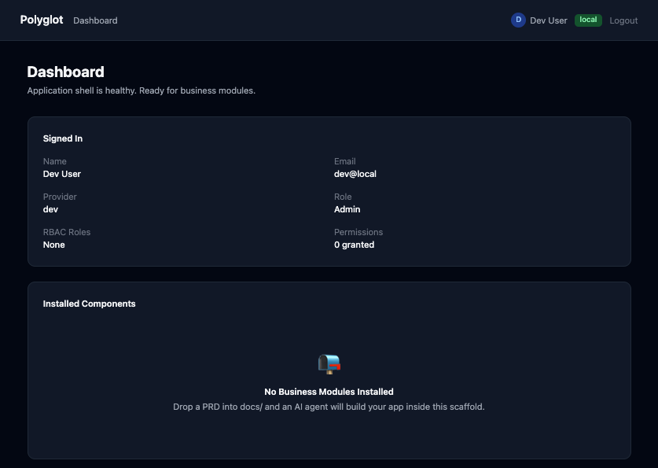
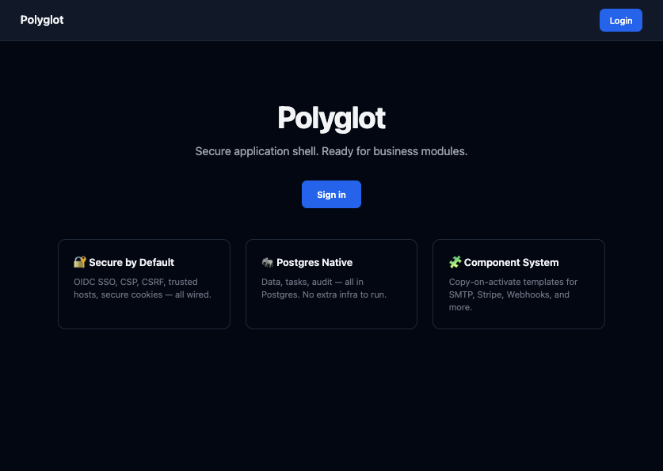
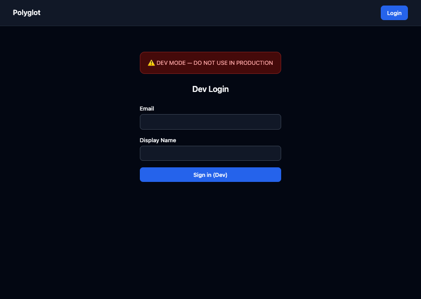

# Polyglot

**AI-native secure application boilerplate.**

Clone it. Configure SSO + Postgres. Run Docker Compose. Log in. Then drop in a PRD and let an AI agent build your business app inside a hardened, well-documented scaffold.



## What You Get

- **FastAPI** app with async SQLAlchemy, Alembic, Pydantic v2
- **SSO** — OIDC (4 providers) + SAML + dev login
- **RBAC** — roles, permissions, `require_permission()` dependency
- **TOTP MFA** — QR setup, challenge flow, backup codes
- **Postgres** — data, tasks (Procrastinate), audit logs, all in one DB
- **Security** — CSP, CSRF, HSTS, security headers, audit logging, RLS docs
- **HTMX + Jinja2** default frontend, **React + Vite** alt
- **11 template packs** — copy-on-activate: SMTP, Stripe, Webhooks, LDAP, etc.
- **Docker Compose** — app, worker, Postgres, optional profiles

## Quick Start

```bash
cp .env.example .env
# Set SECRET_KEY, configure SSO or enable AUTH_DEV_MODE=true
docker compose up --build -d
docker compose exec app alembic upgrade head
```

Open [http://localhost:8000](http://localhost:8000).

## Screenshots

| Home | Login | Dashboard |
|------|-------|-----------|
|  |  |  |

## Architecture

```
FastAPI + Postgres → Task Queue (Procrastinate) → Component System
  ├── OIDC / SAML / Dev Auth
  ├── RBAC (roles + permissions)
  ├── TOTP MFA (on login)
  ├── Audit logging (structured + DB)
  └── 11 copy-on-activate templates
```

## License

MIT
